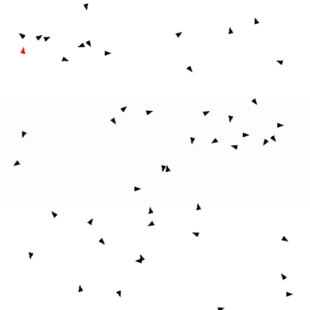

# AI for Robotics project

## Goal

The goal of this project is to reproduce the results of the article [Predator confusion is sufficient to evolve swarming behaviour](http://rsif.royalsocietypublishing.org/content/10/85/20130305)  
by Randal S. Olson, Arend Hintze, Fred C. Dyer, David B. Knoester, Christoph Adami

Some implementation details come from : [Integrated Information Increases with Fitness in the Evolution of Animats](http://journals.plos.org/ploscompbiol/article?id=10.1371/journal.pcbi.1002236) by Jeffrey A. Edlund,
Nicolas Chaumont, Arend Hintze, Christof Koch, Giulio Tononi, Christoph Adami.

  

*Evolved preys and predator. Predator confusion reduces its chances to capture preys*/

  

*Evolved preys and predators. Agents' retina cells can be displayed*

## Dependencies

- [SDL2](https://www.libsdl.org/download-2.0.php)
- [CMake](https://cmake.org/) to build the project
- A C++ compiler supporting the C++17 standard (GCC >= 7, Clang >= 5)

## How to use

### Quick start

1. Compile the project
2. Move the [rsrc](https://gitlab.com/phlf/IAR_project/tree/master/rsrc) folder into the application's working directory
3. Launch the application with a terminal

### Evolving agent

Setting either `evolve_pred` or `evolve_prey` to true will start the evolution process.

### Evaluating agents

It is necessary to disable the evolution process for evaluating the agents. Fitness values are used as file identifiers, just set `predator_file_fitness_value` or `prey_file_fitness_value` to the corresponding fitness in the saved file name to load it.
Set `threads` to 1 and `headless` to 0 to watch the agents' evolved behavior.

## Settings

**Parameter**|**Value**|**Explanation**
:-----:|:-----:|:-----:
headless|1|Run the simulation without graphical display (necessary for evolving agents)
threads|8|Numbers of threads onto which to run the simulation. Each thread runs the simulation for a subset of the Markov Network Brains pool (see `pool_size` parameter). `threads` > 1 ⇔ `headless 1`
win\_w|768|Simulation window's horizontal size in pixels (used only when `headless 0`)
win\_h|768|Simulation window's vertical size in pixels (used only when `headless 0`)
evolve\_pred|1|Enable the evolution process for the predator's brain
evolve\_prey|1|Enable the evolution process for the prey's brain. Setting both `evolve_pred/prey` to 0 enables file loading
prey\_file\_seed\_value|`<seed_value>`|Load the file named "prey\_mb\_`<seed_value>`.txt" storing a prey's brain
predator\_file\_seed\_value|`<seed_value>`|Load the file named "pred\_mb\_`<seed_value>`.txt" storing a predator's brain
generations|1200|Number of generations for evolving preys and predators
pool\_size|4|Size of the brain population to evolve for both preys and predators
grid\_h|512|Simulation's vertical grid size
grid\_w|512|Simulation's horizontal grid size
ticks|2000|Number of steps for simulation: defines one run's duration
torus|1|Defines if the simulation takes place in a toroidal grid
pred/prey\_fov|120|Predator/prey field of view in degrees
pred/prey\_los|100|Predator/prey line of sight in grid units
pred/prey\_mb\_max\_inputs|4|Maximum number of inputs predator/prey's brain's probabilistic logic gates can connect to
pred/prey\_mb\_max\_outputs|3|Maximum number of outputs predator/prey's brain's probabilistic logic gates can connect to
pred/prey\_mb\_nb\_ancestor\_genes|12|Maximum number of outputs predator/prey's brain's
pred/prey\_retina\_cells(\_by\_layer)|12|Number of retina cells (visual inputs) for the agents. The preys have two cells' layers: one reacting to preys, the other to the predators 
pred/prey\_speed|1|Agents' speed in grid units
pred/prey\_turn\_speed|8|Agents' turnrate in degrees
predators/preys|1|Number of agents of each kind
predator\_confusion|1|Enable predator's confusion
proba\_site\_copy|25|1/1000th probability that a genome site get duplicated
proba\_site\_del|50|1/1000th probability that a genome site get deleted
proba\_site\_insert|25|1/1000th probability that a new genome site get inserted
proba\_site\_replaced|50|1/1000th probability that a genome site get replaced by a new one
proba\_site\_gaussian\_mutation|50|1/1000th probability that a genome site undergoes a gaussian mutation
proba\_gene\_duplication|5|1/1000th probability that a gene defining a PLG get duplicated
proba\_gene\_deletion|10|1/1000th probability that a gene defining a PLG get deleted
proba\_new\_gene\_insert|5|1/1000th probability that a new gene defining a PLG get insert into the genome

